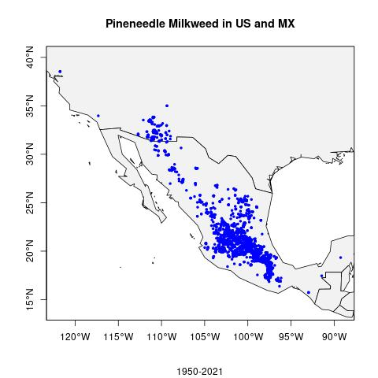
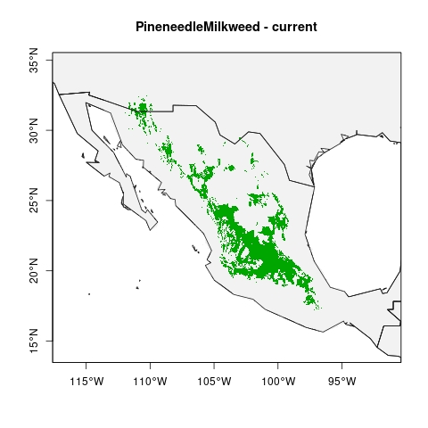

# Species Status Assessment

## Species Name: Pineneedle milkweed *Asclepias linaria*

## Species Taxonomy:
- Kingdom: Plantae
- Phylum: Tracheophyta
- Class: Magnoliopsida
- Order: Gentianales
- Family: Apocynacea
- Genus: Asclepias
- Species: linaria

## Species Description:
*A. linaria* is a rare milkweed species in the US, but common and found throughout
Mexico. It can grow up to 4 feet tall, but is typically around 2 feet tall.
It flowers in the spring and summer annually. It has small, white flowers, woody stems, and needle-shaped leaves. Small plants are sometimes mistaken for juvenile pine trees. It is readily availble for commercial planting in the desert Southwest. 

## Habitat Description:
- Dry rocky slopes and mesas
- elevation: 1500-6000ft

## Larval Host Information:
It is known to be a host plant for monarch butterflies, Queen Butterflies (will feed on other wildflowers instead) and other pollinators. However, it is used only occasionally due to its relative toxicity (Nabhan et al., 2015). In a study comparing *A. linaria* with *Danus plexippus*, another native milkweed to Arizona, female monarchs preferred to lay on *D. plexippus*, had greater larvae survival rates, faster larval development, and reached a larger adult size on *D. plexippus*. However, this leaves many other milkweed species unevaluated, with uncertaintiy as to if *A. linaria* would be preferred compared with others (Pegram and Melkonoff, 2019). Additionally, unpublished data shows that five times more honeybees, *Apis mellifera*, visited *A. linaria* than *D. plexippus* (Pegram and Melkonoff, 2019). 

## Data Sources for Occurence and Distribution Modeling:
- GBIF
- iNaturalist

## Species Occurence Map

#### Link to GitHub Repository [Here](https://github.com/BiodiversityDataScienceCorp/Pineneedles-main-repo)

## Species Distribution Model
### Description of SDM

### Methods for SDM

#### Link to Github Repository [Here](https://github.com/BiodiversityDataScienceCorp/Pineneedles-main-repo)

###### References:
Nabhan, G., S. Buckley, and H. Dial. 2015. Pollinator Plants of the Desert Southwest: Native
Milkweeds (Asclepias spp.). USDA-Natural Resources Conservation Service, Tucson Plant
Materials Center, Tucson, AZ. TN-PM-16-1-AZ. 

Pegram, Kimberly V, and Natalie A Melkonoff. "Assessing Preference and Survival of Danaus Plexippus on Two Western Species of Asclepias." Journal of Insect Conservation 24, no. 2 (2019): 287-95.
